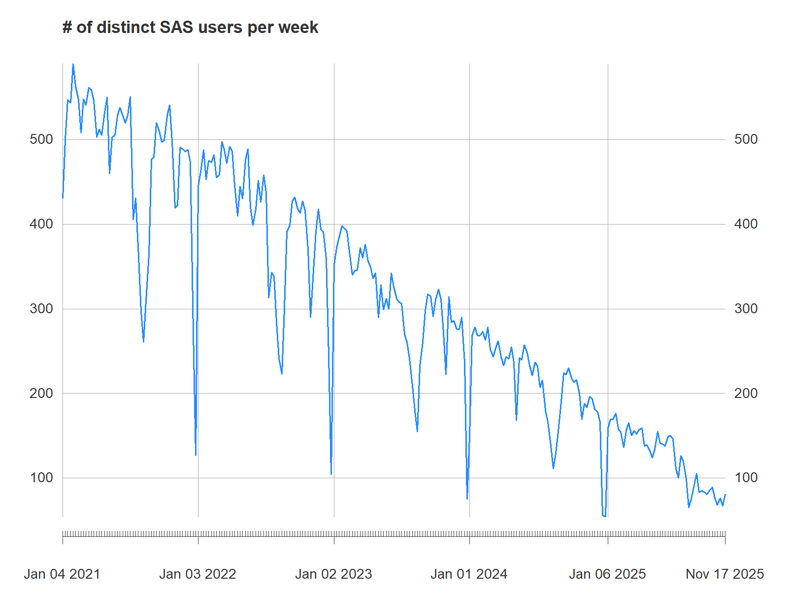
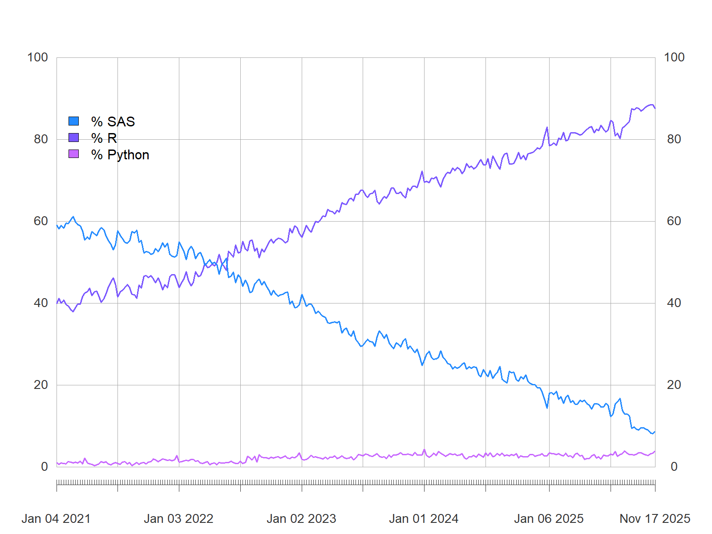

# Insee's Journey Towards Adopting Open-Source {.backgroundTitre_bleu}

## Diffusion of Innovations {.backgroundStandard_bleu}

Rogers, 1962

::: {.r-stack .r-stretch}

, licensed under [CC BY-SA 3.0 Unported](https://creativecommons.org/licenses/by-sa/3.0/deed)](img/DiffusionOfInnovation.png)

:::

## Diffusion of Open-Source in INSEE {.backgroundStandard}

R adoption at INSEE: 1500 statisticians

::: {.r-stack .r-stretch}

 modified by author, licensed under [CC BY-SA 4.0](https://creativecommons.org/licenses/by-sa/4.0/deed)](img/DiffusionOfInnovationTimeline.png)

:::

## An Effective Decrease of SAS Users {.backgroundStandard}

::: {.r-stack .r-stretch}

:::

## Open-Source Languages Adoption {.backgroundStandard}

::: {.r-stack .r-stretch}

:::

# Open-Source Adoption Motivators {.backgroundTitre_violet}

## Innovators' Motivators {.backgroundStandard_violet}

::: {.incremental .large}

**~2000-2012**:

- R graphical capabilities (`lattice`)
- Literate programming with R (`Sweave()`)
- Spatial data analysis using R (`sp`)

:::

## From Innovators to Early Adopters {.backgroundStandard}

::: {.incremental .large}

**2012**:

- First R user group in Paris ([FL\\tauR](https://fltaur.wordpress.com/))
- The use of R officially recognized internally
- First RStudio server

:::

## Early Adopters' Motivators {.backgroundStandard}

::: {.incremental .large}

**2012-2018**:

- RStudio IDE
- Graphical capabilities (`ggplot2`)
- Literate programming (`knitr`, `rmarkdown`)
- Dataviz web applications (`shiny`)
- Data wrangling (`tidyverse`, `data.table`)
- First packages released on CRAN (`icarus`, `btb`, `gustave`)

:::

## Getting the Early Majority {.backgroundStandard}

::: {.incremental .large}

- **2018**: all open source languages officially recognized
- **2018-2022**: a collective skills upgrade
  * mass trainings in R
  * an open source, community-based documentation on R by and for INSEE statisticians: [utilitR](https://www.utilitr.org/)...
  * adoption of an internal open source code publication policy
  * prototyping a new working environment for data science: an open source cloud based datalab ([Onyxia](https://onyxia.sh))

:::

## Moving away from proprietary languages {.backgroundStandard}

::: {.incremental .large}

**2022**: 

- 50% of the statistical scripts already been rewritten in R (voluntary initiatives)
- decision to use only open source languages from 2026 onwards (motivated by the increase in licensing costs)
- new internal environment for statisticians and data scientists based on [Onyxia](https://onyxia.sh) (vendor lock-ins have moved from languages to platforms)
- `parquet` files to store and disseminate data (preference for a cross language file format)

:::

## From early majority to full adoption {.backgroundStandard}

::: {.incremental .large}

**2022-2025**:

- mass trainings for late majority and laggards
- new trainings on [Good Practices with git and R](https://inseefrlab.github.io/formation-bonnes-pratiques-git-R/), [Bringing Data Science Projects into Production](https://ensae-reproductibilite.github.io/website/)
- an active community helping each other
- rewriting of the remaining codes (thanks to ChatGPT for helping us understand SAS programs)
- soft shutdown of SAS servers (09/2025)
- hard shutdown of SAS servers (24/12/2025)

:::

# The Main Challenge of Open-Source Adoption {.backgroundTitre_jaune}

## Lack of alignment between IT and statisticians {.backgroundStandard_jaune}

::: {.incremental .large}

- IT teams are risk averse: they are paid to provide **stable** IT environments
- Providing a working environment for R and python users is challenging: open source languages are **unstable** by nature
- R/python users need flexibility and IT need stability  
  **Can we find a way out?**

:::

## Tips for dealing with IT {.backgroundStandard}

:::: large

Dean Marchiori's post: ["_5 tips for dealing with IT_"](https://www.deanmarchiori.com/posts/2024-11-18-dealing-with-it/)

::: incremental

- **Have empathy**: understand them and what they're facing
- **Political alignment**: convince your manager to help you with IT
- **Find supporters in IT**
- **Find (safe) workaround**: there is always a grey area between what is allowed and what is not 
- **Buy commercially licensed software**

:::

::::

## Tips for dealing with IT {.backgroundStandard}

:::: large

Dean Marchiori's post: ["_5 tips for dealing with IT_"](https://www.deanmarchiori.com/posts/2024-11-18-dealing-with-it/):

- **Have empathy**: understand them and what they're facing
- **Political alignment**: convince your manager to help you with IT
- **Find supporters in IT**
- **Find (safe) workaround**: there is always a grey area between what is allowed and what is not 
- ~~**Buy commercially licensed software**~~ **[not always necessary]{.orange}** 

::::

## How did we align IT and statisticians? {.backgroundStandard}

::: {.incremental .large}

- Political alignment: creation of an innovation team in the IT Department (2018)
- Mutual empathy between IT innovation team and statisticians
- Statisticians' most valuable supporters
- Create workarounds for statisticians: [sspcloud.fr](https://datalab.sspcloud.fr)

:::

## Towards a new deal between IT and statisticians {.backgroundStandard}

::: large

An official statistical office is a socio-technical system. We need:

- people (business units, methods, IT)
- data
- hardware
- software
- law and regulations

:::

## The technology that opened us new horizons {.backgroundStandard}

{.r-stretch fig-align="center"}

## The benefits of containers {.backgroundStandard}

::: {.incremental .large}

- From the outside, they are all identical: IT teams can learn to manage them routinely
- Inside, you can put what you want (any R version, R packages, system dependencies...)
- Containers are now the basis of all data platforms: IT in official statistics offices **must** learn to deal with them
- Containers also used in DevOps platforms

:::

## A new deal between IT and statisticians {.backgroundStandard}

::: {.incremental .large}

- IT cares about containers orchestration and possible vulnerabilities inside them
- IT offers a flexible container based platform (many versions of R, python, IDEs...) and offers support
- IT recognizes statisticians as "citizen developers":
  * statisticians have extensive rights on the infrastructure
  * statisticians are encouraged to apply software development good practices
  * use of git is mandatory
- The DevOps principle applies: **"You build it, you run it"**

:::

## The modern statistician: a proposal {.backgroundStandard}

::: {.incremental .large}

- Uses open source languages
- Adopts good practices for software development (version control, modular code, tests)
- Manages the dependencies of her projects: packages and system dependencies (`renv`, `pak`, `rix`...)
- Has the right (and know how) to build a docker image (linux 101)
- Has the right to orchestrate workflows and deploy applications into production (DevOps)  
  
  > If this is too much for statisticians, we may need to integrate engineers into the business/methods units

:::

# The Remaining Challenges {.backgroundTitre_vert}

## A wall of confusion between statisticians {.backgroundStandard_jaune}

::: {.incremental .large}

  * some statisticians (mostly managers) see R a new statistical "tool". _They focus on the product, not the process_
  * other statisticians (mostly the younger ones) see R as a programming language and recognize themselves as developers. _They care about the process_
  * mass trainings on [Good Practices with git and R](https://inseefrlab.github.io/formation-bonnes-pratiques-git-R/) for both R users and managers

:::

## The missing knowledge of statisticians in computer science {.backgroundStandard}

:::: large

Statistical trainings in university lack solid basis in computer science:

::: incremental

  * Academics have become too specialized
  * Few academics also have a production experience
  * Inspired by [The Missing Semester of Your CS Education](https://missing.csail.mit.edu/), we have created [Bringing Data Science Projects into Production](https://ensae-reproductibilite.github.io/website/) and proposed it to our academic partners

:::

::::

# Take-Away Messages {.backgroundTitre_bleu}

## Take-Away Messages {.backgroundStandard_bleu .titreTransparent data-menu-title="Take-away messages"}

::: large

- Create a community of open-source users
- Invest in mass trainings
- Invest in your IT department
- IT must consider statisticians as (citizen) developers
- Statisticians must also be trained in computer science
- Don't forget to train the middle management

:::

## {#pageDeFin data-menu-title="Page finale" .unnumbered .backgroundPageFinale}

:::: {.columns .coordonneesFinales}

::: {.column .coordonnees width=50%}
- Romain Lesur
- Head of Data Science Lab
- <romain.lesur@insee.fr>
:::

::: {.column .droite width=40%}
:::

::::

